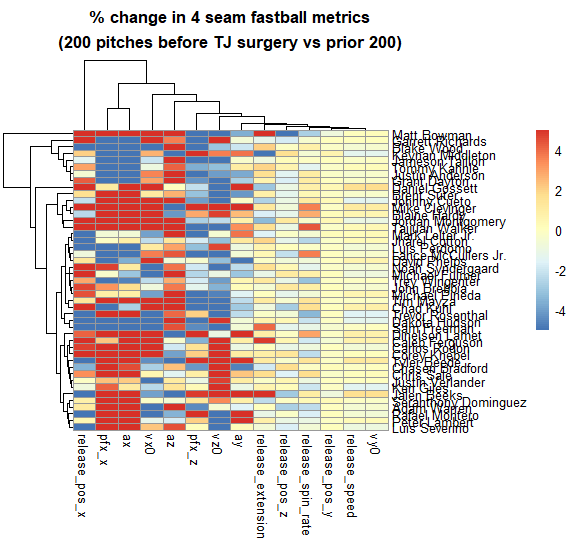
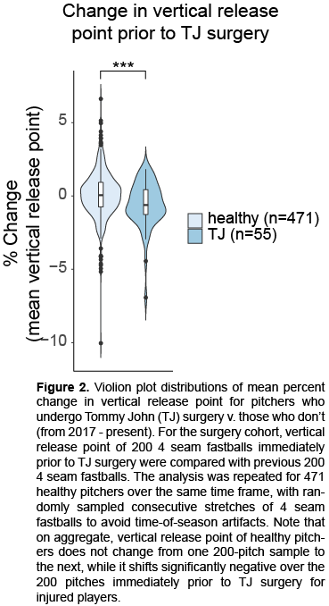

an R package for downloading MLB statcast data
----------------------------------------------

quick start
-----------

##### Install statcastr with `devtools::install_github("devin-AK/statcastr")`

##### Documentation is available for exported functions with e.g. `?fetch_statcast`

To download statcast data for a given day or dates, use
`fetch_statcast()`. The `dates` argument is designed to be as flexible
as possible. A single date of the form yyyy-mm-dd may be used. A
season’s worth of data can be retrieved by entering a year. A range of
dates can be specified with the separator `" to "`.

``` r
library(statcastr)
sc <- fetch_statcast('2017 April 12 to 2017 April 14', verbose=TRUE)
sc
```

    ## statcast data.table object 
    ## --------------------------
    ##  -> 12107 pitches from 274 pitchers
    ##  -> data from 2017-04-12 to 2017-04-14 ( 3 days total )
    ## --------------------------
    ## Access raw data with d() and individual metrics with `$`

``` r
# sc <- fetch_statcast(c(20170412,'2017Apr13 to 20170414')) # same as above, flexibility with dates argument
```

`fetch_statcast()` is agnostic to the MLB schedule. By default, it first
generates a server query for the number of pitches thrown on a given
date, and then downloads data corresponding to days with at least 1
pitch thrown. The purpose of this functionality is twofold: 1. the user
does not need to know the MLB schedule ahead of time, and 2. it serves
as an extra quality check, as the final number of fetched pitches is
compared with the pitch number query from that date. This way if there
is a server error during download of a particular date, the function
will issue a warning.

-\> Peak at the data with `d(sc)`, or get a summary with `summary(sc)`

Tips
----

-\> Save data locally for quick re-loading in the future:
`save_statcast(sc, output="example.RDS")`

-\> To export in human-readable format, specify `.csv` as the file
extension. If no file extension is included, data will be saved as an
.RDS file.

-\> A statcast data object can be re-loaded at a later time:
`sc <- load_statcast("example.RDS")`. This function will also recognize
.csv format.

-\> Additional or new data can be added to an existing statcast object
with:

``` r
sc <- update_statcast(sc, dates=20170416, verbose=F)
```

-\> For convenience, data can alwawys be sorted in chronological order
with `sort_statcast()`

-\> Objects of class `statcast` inherit from `data.table-class`, and can
therefore be interacted with as such

``` r
boxplot(sc[player_name=='Clayton Kershaw' & pitch_type=='SL']$release_speed,ylab='MPH')
```

Findings
----
Damage to the ulnar collateral ligament (UCL) remains one of the most common injuries in Major League Baseball. From 2004 to 2014, the estimated cost of recovery (COR) for UCL reconstruction amounted to $395 million. It is of utmost importance to identify biomechanical causes and symptoms of UCL injury, in order to prevent and predict ligament rupture. 

Question: Do changes in statcast metrics correlate with subsequent TJ surgery?

Hypothesis: Changes in one or more metrics (e.g. release point or velocity) may indicate present or imminent injury.

Methods: I fetched all statcast data from April 2 2017 to the present and also compiled a database of players who underwent Tommy John surgery during this same time period. For each player with TJ surgery, I compared his 4 seam fastball statcast metrics of the 200 pitches immediately prior to TJ surgery, with the 200 he threw before those. I repeated this analysis for all of the healthy pitchers, varying the time at which pitch samples were pulled to avoid systematic artifacts arising from time of season. Interestingly, pitchers who ultimately had TJ surgery exhibited a significant change in vertical release point with their 4 seam fastballs prior to TJ surgery. This change in release point is not observed in the group of healthy pitchers. The difference in distribution of release point change between injured and healthy pitchers is statistically significant, even after applying FDR correction for multiple hypothesis testing. 

Notes: These findings do not suggest causality in one direction or the other, as no assumptions can be made about whether the changes in vertical release position cause injury or are symptomatic of an underlying problem. Regardless, they may be useful in identifying UCL damage before TJ surgery is required.




